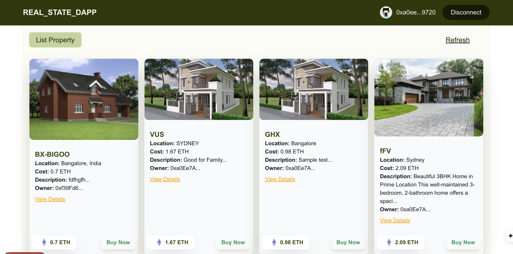
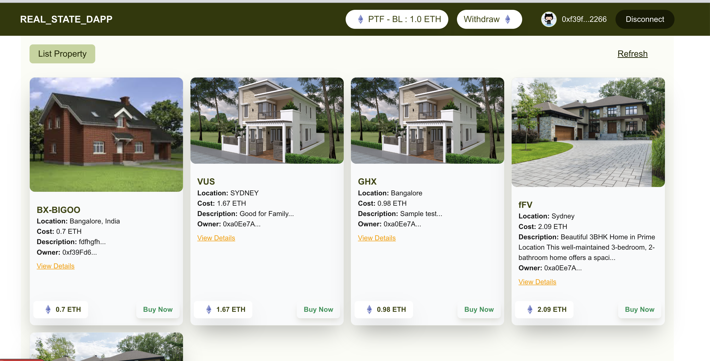

# Real Estate DApp

This is a decentralized real estate application (DApp) built with Solidity smart contracts and designed for integration with a Next.js frontend. The platform enables sellers to list properties for sale, buyers to purchase properties using ETH, and the platform owner to collect and withdraw platform fees. The backend smart contracts are developed and tested using the Foundry toolkit.

## Features

- **Seller:**
  - List properties for sale on the platform by providing details such as name, location, price, description, and images (IPFS URLs).
  - Pay a platform fee (in ETH) when listing a property. The minimum listing fee is enforced by the smart contract.
- **Buyer:**
  - Browse all available properties through the `getPropertyList` function, which returns active property listings.
  - Purchase properties using ETH. The contract ensures the buyer is not the property owner and that sufficient funds are sent.
  - Once a property is purchased, it is removed from the listing and ownership is transferred.
- **Platform Owner:**
  - Receives platform fees from property listings and property purchases.
  - Can view the platform's accumulated balance and withdraw ETH fees at any time using owner-only functions.

## Smart Contract Highlights

- **Role-based Access:**
  - The deployer of the contract is set as the platform owner and has exclusive access to sensitive functions (e.g., withdrawing fees, viewing platform balance).
  - Utility functions like `isPlatformOwner` make it easy to implement role-based access in the frontend.
- **Event Logging:**
  - Key actions such as property purchases emit events (e.g., `PropertyPurchased`) that can be listened to in the frontend for real-time UI updates.
- **Property Management:**
  - Properties are stored in a mapping and can be retrieved by ID or as a list of active properties.
  - Deleted or purchased properties are filtered out from the active listings.
- **Testing & Deployment:**
  - Includes automated tests for all major contract functions using Foundry.
  - Deployment scripts are provided for local and live networks.

## Getting Started

### Prerequisites
- Node.js and npm
- Foundry (for smart contract development)
- An Ethereum wallet (e.g., MetaMask)

### Install Dependencies
```bash
npm install
```

### Run the Development Server
```bash
npm run dev
```

Open [http://localhost:3000](http://localhost:3000) with your browser to see the result.

### Smart Contract Development
- Build contracts: `forge build`
- Run tests: `forge test`
- Deploy locally: `anvil` (start local node), then use the provided deployment script

## Platform Flow

1. **Seller lists a property:**
   - The seller provides property details and pays a platform fee.
   - The property is added to the public listing and can be browsed by buyers.
2. **Buyer purchases a property:**
   - The buyer selects a property and completes the purchase with ETH.
   - The property is removed from the listing after purchase, and the seller receives the payment.
3. **Platform owner withdraws fees:**
   - The platform owner can withdraw accumulated platform fees at any time using owner-only functions.

## Role-based Access

- **Platform Owner:** Can withdraw platform fees and view platform balance.
- **Seller:** Can list properties (with a fee).
- **Buyer:** Can purchase properties.

## File Structure

- `src/RealEstatePlatform.sol` – Main smart contract for property management and transactions.
- `test/TestReastEstatePlatform.t.sol` – Automated tests for contract logic.
- `script/DeployRealEstatePlatform.s.sol` – Deployment script for the contract.
- `README.md` – Project documentation and usage instructions.

## UI Previews

Buyer / Seller View:


Platform Owner View:


---

